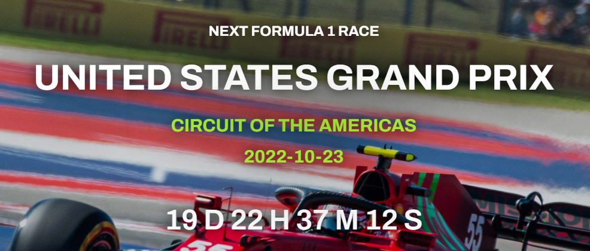
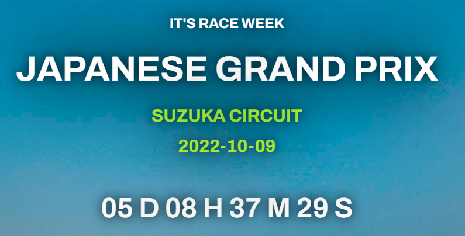
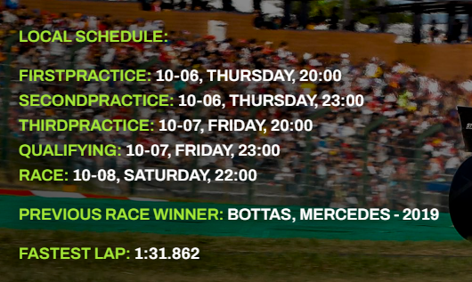
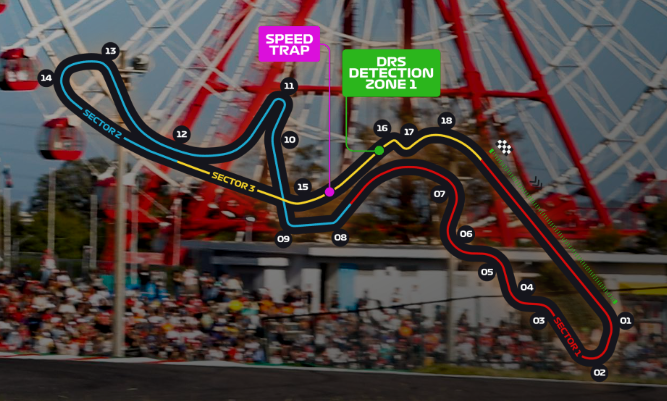
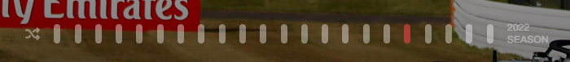
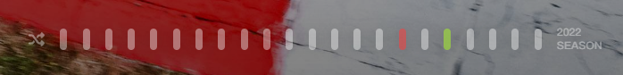
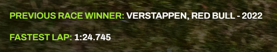

<!-- Improved compatibility of back to top link: See: https://github.com/othneildrew/Best-README-Template/pull/73 -->

<!-- PROJECT LOGO -->
 

  <a href="https://github.com/plumsily/f1-new-tab">🏎️
  </a>

<h3 align="center">F1 New Tab Page for Google Chrome</h3>

  

    This Chrome extension will replace the default new tab page with one that displays current Formula 1 race information as well as providing wallpaper quality images of each circuit.
     
     
    <a href="https://plumsily.github.io/f1-new-tab/"><strong>View it live here!</strong></a>
  

<!-- TABLE OF CONTENTS -->

  
Table of Contents

  <ol>
    <li>
      <a href="#about-the-project">About The Project</a>
      <ul>
        <li><a href="#built-with">Built With</a></li>
      </ul>
    </li>
    <li><a href="#usage">Usage</a></li>
    <li><a href="#roadmap">Roadmap</a></li>
    <li><a href="#acknowledgements">Acknowledgements</a></li>
    <li><a href="#contact">Contact</a></li>
  </ol>

<!-- ABOUT THE PROJECT -->

## About The Project

This app was inspired by various other Chrome new tab replacers that display aesthetic backgrounds. Additionally, I wanted to serve relevant info related to F1 races at a quick glance. The combination of those motivations resulted in a page that automatically displays the next upcoming race on the schedule. Race info is obtained via the Ergast Developer API. Features include:

- Countdown to upcoming races
- Several wallpaper quality backgrounds
- Track layout map
- Practice, qualifying, and race times adjusted to local time
- Historical records like the previous race winner and fastest lap time
- History bar to access all rounds of the season

(<a href="#readme-top">back to top</a>)

### Built With

- React
- Tailwind
- Firebase

(<a href="#readme-top">back to top</a>)

<!-- USAGE EXAMPLES -->

## Usage

Pertinent info is displayed at the center of the page. This includes the name of the race, name of the circuit, date, and (if applicable) countdown until the race date.

 

For the nearest upcoming race, within one week, the title will change accordingly.

 

For upcoming races, local schedule times will be displayed at the bottom left along with historical records like previous race winner and fastest lap times.

 

For all races, the track layout map will be displayed at the bottom right. Here all turn numbers and DRS zones are shown.

 

To access other races like past races of the season, a history bar on the bottom center of the page allows access to all rounds. Currently displayed race is indicated by a red pill. The next upcoming race is indicated by a green pill when not displayed. At the end of the season, the race shuffle button will be selected by default.

 

For past races, only the current race winner and fastest lap time will be shown.

_For more examples, please refer to the [Documentation](https://example.com)_

(<a href="#readme-top">back to top</a>)

<!-- ROADMAP -->

## Roadmap

- [x] 2022 race schedule info and track layout
  - [x] Background wallpaper shuffling
  - [x] Countdown for next upcoming race
  - [x] Automatic display of next upcoming race info
- [x] History bar to access past races of the season
  - [x] Shuffling button
    - [x] Active by default at end of season to cycle all races
- [ ] Chrome extension store approval
- [ ] 2023 race schedule assets for Firebase

See the [open issues](https://github.com/plumsily/f1-new-tab/issues) for a full list of proposed features (and known issues).

(<a href="#readme-top">back to top</a>)

<!-- ACKNOWLEDGEMENTS -->

## Acknowledgements

<a href="http://ergast.com/mrd/">Ergast Developer API</a> for F1 records.

(<a href="#readme-top">back to top</a>)

<!-- CONTACT -->

## Contact

Justin Lee - [@plumsily](https://twitter.com/plumsily)

Project Link: [https://github.com/plumsily/f1-new-tab](https://github.com/plumsily/f1-new-tab)

(<a href="#readme-top">back to top</a>)

